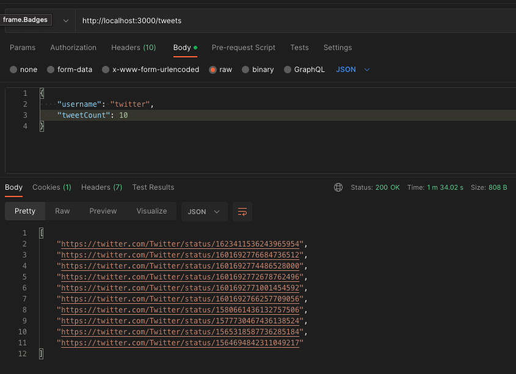
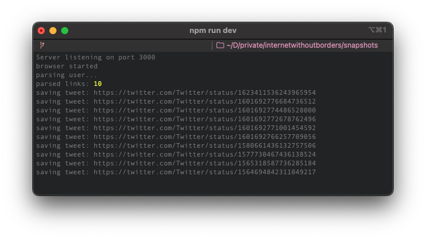

# lantern-twitter-scrapper

Twitter scraper service that make screenshots of the last 100 tweets for a given username.

## Request

To make it happen run the server and send [POST] request `/tweets`
It accepts json body with fields:
- *username* - (required) twitter username
- *tweetCount* - (optional) count of last tweets to parse (default: 100)

The query returns an array of links to the tweets that have been parsed and saved.

Attention! The request may take longer than 30 seconds (default timeout).
In this example, it took 104 seconds for 10 tweets.

## Development

1. copy .env.example file for your local .env and set vars
2. npm i
3. npm run dev (it requires nodemon)

If you want to see how puppeteer works and parses data, then set env variable `PUPPETEER_HEADLESS=false` in your `.env` file.

## Production

1. copy .env.example file for your local .env and set vars
2. npm i
3. pm2 start (it requires pm2)
